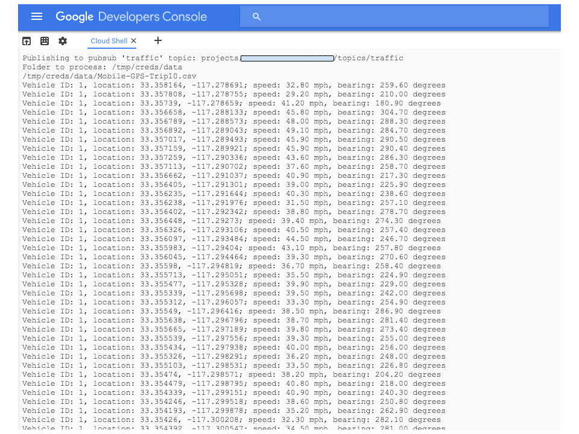
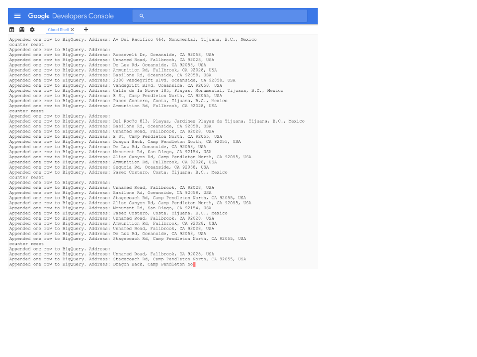

<!--
Conversion notes (using libgdc version 59) :
-->

<!-- generated styles -->
<style type=text/css>
  .tab0 {background-color:#3366cc;color:#333333;}
  .tab1 {background-color:#e5ecf9;}
  .tab2 {background-color:#aa0033;color:#333333;}
  .tab3 {background-color:#ffcccc;}
  .tab4 {background-color:#aa0033;}
  .tab5 {background-color:#999999;}
  .tab6 {background-color:#efefef;}
</style>


# Adding geographic context to your streaming data with Google’s Pubsub and Maps APIs - Using Docker


This tutorial shows how to use Google Cloud Platform to build an app that receives telemetric data about geolocation, processes it, and then stores the processed and transformed data for further analysis. 
The instructions in this README assumes you have already carried out the pre-reqs detailed in the README  for the project as whole and cover teh steps specific to using Docker .


## Credentials file for use with  Docker

If you have been following the main README file you should have created a credentials file . These instructions are recreated here for your convenience
##### Service account credentials


Create service account credentials and download the JSON file. Follow these steps:

1. Click **Create credentials** and then select **Service account key**.
1. Select **New service account**.
1. Name the account "Maps tutorial service account".
1. The key type is **JSON**.
1. Click **Create**.
1. The Cloud Console automatically downloads to your computer the JSON file that contains the service account key.
1. Click **Close** to dismiss the dialog box that shows you the new key. If you need to, you can retrieve the key file later.

<table>
 <tr>
    <td class="tab5"></td>
    <td class="tab6"><strong>NOTE: </strong>You will need this file if you decide to use Docker to run the example. For more details read the README included in the Docker folder of this repository if you wish to use Docker </td>
 </tr>
</table>


<table>
 <tr>
    <td class="tab0"></td>
    <td class="tab1"><strong>IMPORTANT: </strong>It is important that you keep this file safe and do NOT share it publically.</td>
 </tr>
</table>

##### Using Cloud Storage
If you  intend to run Docker on your laptop skip to the next section. If you are going to run Docker on a GCE instance or CloudShell then you will need to transfer your service account credential file to the instance. The easiest way to do this is to use a Cloud Storage bucket as a temporary transfer path

1. Create a storage bucket using the gsutil command 

```
$ gsutil mb -p your-project gs://your-bucket
```


<table>
 <tr>
    <td class="tab2"></td>
    <td class="tab3"><strong>WARNING: </strong>This bucket will be used to store the credential file that you created earlier
so Do NOT make this a publically accessible bucket by changing any of the
default settings</td>
 </tr>
</table>
2. Copy the credential file you created earlier to your newly created bucket  you
can use the console  or  use the gsutil command from the machine you have
installed the gcloud SDK to using the following command


```
$ gsutil cp your-credentials-file.json gs://your-bucket
``` 
 
  
##Setting up and running the example  


No familiarity with python
is necessary if following these quick steps


Note the name of the topic and subscription 

1.From the Developers console start a [cloudshell instance](https://cloud.google.com/cloud-shell/docs/quickstart)  

2.ssh into the instance 

3.Clone this repository to your instance

3.In the resources folder there is a  shell script called setup.sh with the following contents:  


```
# setup.sh
mkdir /tmp/creds
bq mk sandiego_freeways
bq mk --schema geocoded_journeys.json sandiego_freeways.geocoded_journeys
mkdir /tmp/creds/data
cp resources/data/* /tmp/creds/data/
cp resources/setup.yaml /tmp/creds/
```

This script will create a BigQuery dataset, copy the test data into /tmp/creds/data and copy a template setup.yaml file into /tmp/creds

   
4.Set the setup bash script to be executable and run it 


```
$ chmod +x setup.sh
$  ./setup.sh

```

5.change your working directory to /tmp/creds and edit the setup.yaml file
It has the following contents, 


```
env:
# Change to your project ID
    PROJECT_ID: 'your-project-id'
# Change to  datasetid
    DATASET_ID: 'sandiego_freeways'
# Change to tableid
    TABLE_ID: 'geocoded_journeys'
# Change this to your pubsub topic
    PUBSUB_TOPIC: 'projects/your-project-id/topics/traffic'
# Change the following to your rootdir
    ROOTDIR: '/tmp/creds/data'
# Change the following to your pull subscription
    SUBSCRIPTION: 'projects/your-project-id/subscriptions/mysubscription'
# Change to your Google Maps API Key, see
https://developers.google.com/maps/web-services/
    MAPS_API_KEY: 'Your-server-key'
```

Edit  to reflect your project ID and adding your
Maps API key you created earlier

6.copy the credentials file from the storage bucket  into /tmp/creds 


```
$gsutil cp gs://your-bucket/your-credentials-file.json . 
```

 

7.Create and run the  Docker instance that processes the test data by geo
encoding it  and publishing to the pub/sub topic defined in the setup.yaml file
you edited earlier


```
$ docker run -e
"GOOGLE_APPLICATION_CREDENTIALS=/tmp/creds/your-credentials-file.json"  --name
map-push -v /tmp/creds:/tmp/creds gcr.io/cloud-solutions-images/map-pushapp

```

You should see it start to push data into pub/sub 




8.create and run the Docker instance that pulls the data out of pub/sub reverse
geo- encodes it and writes it to the BigQuery dataset you created earlier


```
$ docker run -e
"GOOGLE_APPLICATION_CREDENTIALS=/tmp/creds/your-credentials-file.json"  --name
map-app -v /tmp/creds:/tmp/creds gcr.io/cloud-solutions-images/map-pullapp

```

You should start seeing repeated output like below as the data is being pulled out of Pub/Sub and added to your BigQuery table


It can take some to pull all the data from the topic. When it's done, the terminal window will simply stop showing lines of output as it waits for further data. You can exit the process at any time by pressing Control+C.


9.Now you can start analysing the data to get some interesting insights into the
data
 

Go back to the main README file and continue from the **Analysing the data section**


