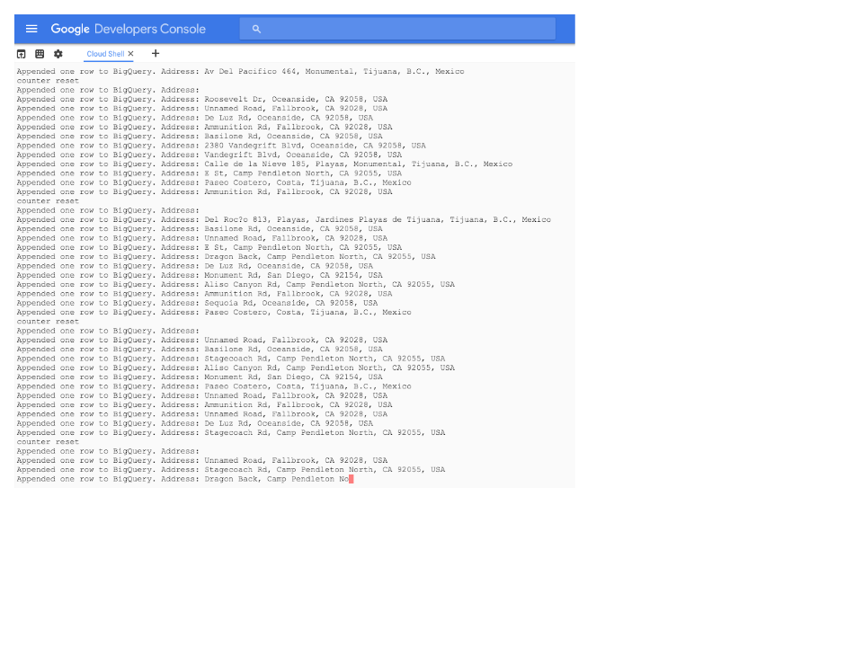

<!--
Conversion notes (using libgdc version 59):
-->

<!-- generated styles -->
<style type=text/css>
  .tab0 {background-color:#3366cc;color:#333333;}
  .tab1 {background-color:#e5ecf9;}
  .tab2 {background-color:#aa0033;color:#333333;}
  .tab3 {background-color:#ffcccc;}
  .tab4 {background-color:#aa0033;}
  .tab5 {background-color:#999999;}
  .tab6 {background-color:#efefef;}
</style>

 <table>
 <tr>
    <td class="tab5"></td>
    <td class="tab6"><strong>NOTE: </strong>For internal review/ testing purposes the csv files used are stored here : https://storage.googleapis.com/gmweb1436173097/data/
   </td>
 </tr>
</table>


# Adding geographic context to your streaming data with Google’s Pubsub and Maps APIs

In this tutorial you will deploy an application that processes messages in a
pub/sub queue reverse geocodes them (converts latitude & longitude to a street
address), calculates the elevation above sea level, and converts from UTC time
to local time by querying which timezone the locations fall in. It then writes
the data plus this added geographic context to  a BigQuery  for you to analyse
as described in the [Maps API & Google cloud getting started solution paper](https://docs.google.com/a/google.com/document/d/1j4lxVUfypjIF7J8vS-HiKcnDYdC0d7uuR6P02vgufCI/edit?usp=sharing)

You will use Google Compute engine, pub/sub and BigQuery to deploy the
application . The solution will resemble this diagram when you’re done


## <strong>Very Important Things</strong>

If you follow these instructions exactly, you will deploy 1  g1-small GCE
instance configure a pub/sub topic and subscription  and create a BIgQuery
table . The resources  are billed. It is very important that you follow the
instructions to turn off the resources  if you do not want to continue to be
billed for these resources.  <LInk to a calculator quote > provides an estimate
of the monthly cost of the resources provisioned in this example.

Be sure to create a brand new project for this tutorial (instructions are in
the deploy sections below). Also be sure to complete the <Delete the
Deployment> section when you're done. It's super quick and will tear down
everything you created.

## <strong>Conventions</strong>

The instructions in this tutorial assume you have access to a terminal on a
Linux or OS X host. For Windows hosts, [Cygwin](http://cygwin.com/) should work.

You will need to enter commands in your terminal. Those commands are indicated
in the following format, where <code>$</code> indicates a prompt (do not paste the $ into your terminal, just everything
that follows it):


<pre class=prettyprint>
$echo “this is a Sample command” 
</pre>

## <strong>Deploy</strong>

### <strong>Deployment Requirements</strong>

Before you deploy the sample you'll need to make sure a few things are in
order:

Sign up for a Google Cloud Platform account if you do not already have one

Sign up for a Maps API key if you do not have one (maps for Work customers can use their client ID). 
You will need a [server key](https://developers.google.com/maps/documentation/geocoding/get-api-key) to use the Geocoding, Elevation and Timezone APIs. You will need a [browser key](https://developers.google.com/maps/documentation/javascript/) to use the Javascript Maps API to visualise your data

Create a new project in the [Google Developer Console](https://console.developers.google.com/project) and note the new project's ID.

In the [APIs & Auth section of the Google Developers Console](https://console.developers.google.com/project/_/apiui/api) of your new project, enable the following APIs:

     * BigQuery API
     * Pubsub API
     * Google Cloud Storage
     * Google Maps Geocoding API
     * Google Maps Elevation API
     * Google Maps Timezone API

Once you've enabled the APIs, you need to generate a key to use with the maps
API  click <strong>Credentials</strong> from the left navigation of the Developer Console.

From  the "<strong>API Credentials</strong> " <strong>Add credentials</strong> drop down select  <strong> API</strong> <strong>Key</strong>.

Choose <strong>Server Key</strong>.  

If you'd like to restrict requests to a specific IP address, do so now.

Click <strong>Create</strong>.

Your API key should be 40 characters long, and begin with AIza.

You  will  also need to create a [credentials file](https://support.google.com/cloud/answer/6158849?hl=en#serviceaccounts)  from the <strong>“API credentials”  Add credentials </strong>drop down select <strong>service account </strong>, keep the default JSON format 

Click <strong>Create</strong> and save the file somewhere safely  

<table>
 <tr>
    <td class="tab0"></td>
    <td class="tab1"><strong>IMPORTANT: </strong>It is important that you keep this file  safe and do NOT share it publically.</td>
 </tr>
</table>

Install  the cloud SDK to your workstation use  [these instructions](https://cloud.google.com/sdk/).

Authenticate to gcloud:


```
$ gcloud auth login
```
Set your project:


```
$ gcloud config set project YOUR_PROJECT_ID
```
If you are using Windows to complete the tutorial, install [Cygwin](http://cygwin.com/) and execute the steps in a terminal.

Create a storage bucket 

<table>
 <tr>
    <td class="tab2"></td>
    <td class="tab3"><strong>WARNING: </strong>This bucket will be used to store the credential file that you created earlier
so Do NOT make this a publically accessible bucket by changing any of the
default settings</td>
 </tr>
</table>

Copy the credential file you created earlier to your newly created bucket  you
can use the console  or  use the gsutil command from the machine you have
installed the gcloud SDK to using the following command


<pre class=prettyprint>
$ gsutil cp your-credentials-file.json gs://your-bucket
</pre>

Quick deploy

These Quick deploy instructions using Docker  are the easiest way to get
started

Note : It is assumed that you  have familiarity with git , are able to open &
edit  text files and  run some simple bash scripts . No familiarity with python
is necessary if following these quick steps

1.First create your pub/sub topic by navigating to the pub/sub console from the [Google Developer Console](https://console.developers.google.com/project) Click on New Topic add the name of your topic  so the topic entry looks like this :

  
 
2.Now create the subscription by checking the box alongside the topic  and clicking the “+ new subscription button” Ensure it is set to pull

 


 Note the name of the topic and subscription 

3.From the Developers console start a [cloudshell instance](https://cloud.google.com/cloud-shell/docs/quickstart)
4.ssh into the instance
5.Create a shell script called setup  with the following contents:


<pre class=prettyprint>
# setup.sh
apt-get install -y unzip
mkdir /tmp/creds
bq mk sandiego_freeways
bq mk --schema geocoded_journeys.json sandiego_freeways.geocoded_journeys
mkdir /tmp/creds/data
cd /tmp/creds/data
curl -O
http://storage.googleapis.com/sandiego_freeway_gps_trips/Mobile-GPS-Trip1.csv
curl -O
http://storage.googleapis.com/sandiego_freeway_gps_trips/Mobile-GPS-Trip10.csv
curl -O
http://storage.googleapis.com/sandiego_freeway_gps_trips/Mobile-GPS-Trip100.csv
curl -O
http//storage.googleapis.com/sandiego_freeway_gps_trips/Mobile-GPS-Trip1000.csv
</pre>

This script creates a BigQuery dataset and also downloads some test data

6.Set the setup bash script to be executable and run it 


<pre class=prettyprint>
$chmod +x setup.sh
$  ./setup.sh
</pre>

7.change your working directory to /tmp/creds and create a file called setup.yaml
with the following contents, editing to reflect your project ID and adding your
Maps API key you created earlier


<pre class=prettyprint>
env:
# Change to your project ID
    PROJECT_ID: 'your-project-id'
# Change to  datasetid
    DATASET_ID: 'sandiego_freeways'
# Change to tableid
    TABLE_ID: 'geocoded_journeys'
# Change this to your pubsub topic
    PUBSUB_TOPIC: 'projects/your-project-id/topics/traffic'
# Change the following to your rootdir
    ROOTDIR: '/tmp/creds/data'
# Change the following to your pull subscription
    SUBSCRIPTION: 'projects/your-project-id/subscriptions/mysubscription'
# Change to your Google Maps API Key, see
https://developers.google.com/maps/web-services/
    MAPS_API_KEY: 'Your-server-key'
</pre>

8.copy the credentials file from the storage bucket  into /tmp/creds 


<pre class=prettyprint>
$gsutil cp gs://your-bucket/your-credentials-file.json . 
</pre>

 

9.Create and run the  Docker instance that processes the test data by geo
encoding it  and publishing to the pub/sub topic defined in the setup.yaml file
you edited earlier


<pre class=prettyprint>
$ docker run -e
"GOOGLE_APPLICATION_CREDENTIALS=/tmp/creds/your-credentials-file.json"  --name
map-push -v /tmp/creds:/tmp/creds gcr.io/cloud-solutions-images/map-pushapp

</pre>

You should see it start to push data into pub/sub 


<table>
 <tr>
    <td class="tab4"></td>
    <td class="tab3"><strong>WARNING: </strong>If you do not see  any lines being processed check that you have successfully
copied the data files  open one to check that you have not got an error written
to the file that looks like this: This is a permission error 
<pre class=prettyprint>
&lt;?xml version='1.0'
encoding='UTF-8'?>&lt;Error>&lt;Code>AccessDenied&lt;/Code>&lt;Message>Access
denied.&lt;/Message>&lt;Details>Anonymous callers do not have
storage.objects.get access to object
sandiego_freeway_gps_trips/Mobile-GPS-Trip10.csv.&lt;/Details>&lt;/Error>yourusername@Project-id-here:/tmp/creds/data</td>
 </tr>
</table>


10.create and run the Docker instance that pulls the data out of pub/sub reverse
geo- encodes it and writes it to the BigQuery dataset you created earlier


<pre class=prettyprint>
$ docker run -e
"GOOGLE_APPLICATION_CREDENTIALS=/tmp/creds/your-credentials-file.json"  --name
map-app -v /tmp/creds:/tmp/creds gcr.io/cloud-solutions-images/map-pullapp

</pre>



11.Now you can start analysing the data to get some interesting insights into the
data. Skip to the analysing data section ( skip the step by step deployment
section) 

### Deployment instructions (step by step)

This step by step deployment instructions are the best starting point if you
wish to  take the source code and modify for your specific  use case

<table>
 <tr>
    <td class="tab5"></td>
    <td class="tab6"><strong>NOTE: </strong>It is assumed that you are able to open & edit  text files , run some simple
bash scripts and have some familiarity with Python if using these step by step
instructions. Python version needs to be 2.7 </td>
 </tr>
</table>

1.First clone this repository to a local folder on your laptop or on a GCE
instance
2.Next you need to get hold of the example data . We are using  data from the [Sandiego freeway public dataset](http://catalog.data.gov/dataset/intelligent-transportation-systems-research-data-exchange-san-diego-freeway-data-daily) . Register and you can freely download some example datasets or you can
download a smaller subset  as indicated here


<pre class=prettyprint>
curl -O
http://storage.googleapis.com/sandiego_freeway_gps_trips/Mobile-GPS-Trip1.csv
curl -O
http://storage.googleapis.com/sandiego_freeway_gps_trips/Mobile-GPS-Trip10.csv
curl -O
http://storage.googleapis.com/sandiego_freeway_gps_trips/Mobile-GPS-Trip100.csv
curl -O
http://storage.googleapis.com/sandiego_freeway_gps_trips/Mobile-GPS-Trip1000.csv
</pre>

These files contain real GPS vehicle journey data from San Diego freeways.


[See this file for copyright info:](http://storage.googleapis.com/sandiego_freeway_gps_trips/o/docs%2Flicense%20and%20copyright(san%20diego).txt)

3.Copy the csv files into an empty  folder of your choice on your laptop or on a
GCE instance
4.You can get a bigger sample set for a   more realistic demo from [here](http://catalog.data.gov/dataset/intelligent-transportation-systems-research-data-exchange-san-diego-freeway-data-daily) .If you decide to do this then ensure you copy the csv files into the folder
defined by the ROOTDIR in the setup.yaml file
5.Create your pub/sub topic by navigating to the pub/sub console from the [Google Developer Console](https://console.developers.google.com/project)
i. Click on New Topic add the name of your topic  so the topic entry looks like
this :

 

ii. Now create the subscription by checking the box alongside the topic  and clicking the “+ new subscription button” Ensure it is set to pull

 

iii. Note the name of the topic and subscription 
6. change location  to the folder where you cloned the repository 
7.Now run the python script to populate the pub/sub topic using the following
command:


<pre class=prettyprint>
$ ~/push_pubsub_docker/python  config_geo_pubsub_push.py
</pre>

<table>
 <tr>
    <td class="tab2"></td>
    <td class="tab3"><strong>WARNING: </strong>Make sure you  have  the appropriate details set in the setup.yaml file and
that the script is pointing to the correct location for the  setup.yaml file</td>
 </tr>
</table>

8.Create an empty Big Query dataset using the following command:  


<pre class=prettyprint>
$bq mk sandiego_freeways 
</pre>

 

on successful creation you will see a message similar to the following:

<em>Dataset 'Your-Project_ID:sandiego_freeways' successfully created.</em>

9.Next create a table  with the following schema 

 


10.You can do this by passing the json schema file you downloaded when cloning the
git repository  to the bq mk command as below ( or manually via the console):


<pre class=prettyprint>
$ bq mk --schema geocoded_journeys.json sandiego_freeways.geocode_journeys
</pre>

 

11.Update the setup.yaml file with the following details

<table>
 <tr>
    <td>variable to update</td>
    <td></td>
 </tr>
 <tr>
    <td>PROJECT_ID:</td>
    <td>Change to your project ID</td>
 </tr>
 <tr>
    <td>DATASET_ID:</td>
    <td>Change to  BigQuery  datasetid (sandiego_freeways)</td>
 </tr>
 <tr>
    <td>TABLE_ID:</td>
    <td>Change to  BigQuery tableid (geocoded_journeys)</td>
 </tr>
 <tr>
    <td>PUBSUB_TOPIC:</td>
    <td>Change to pub/sub topic</td>
 </tr>
 <tr>
    <td>ROOTDIR: </td>
    <td>Change to folder where csv test data kept</td>
 </tr>
 <tr>
    <td>SUBSCRIPTION: </td>
    <td>Change the following to your pub/sub pull subscription </td>
 </tr>
 <tr>
    <td>MAPS_API_KEY:</td>
    <td>Change to your Google Maps API Key, see
https://developers.google.com/maps/web-services</td>
 </tr>
</table>

12.Now run the python script to process the messages  in pub/sub topic using the
following to run the python script : 


<pre class=prettyprint>
$python config_geo_pubsub_pull.py 
</pre>


<table>
 <tr>
    <td class="tab5"></td>
    <td class="tab6"><strong>NOTE: </strong>if setup.yaml is not in the same folder as your script then either move
it there or edit the script to reflect it’s location </td>
 </tr>
</table>

The script moves messages from the pub/sub queue, reverse geocodes them
(converts latitude & longitude to a street address), calculates the elevation
above sea level, and converts from UTC time to local time by querying which
timezone the locations fall in. It then writes the data plus this added
geographic context to the BigQuery table you created earlier

Now you can start analysing the data to get some interesting insights into the
data.

Analysing the data

  1.From the Cloud console navigate to the BigQuery link on the left hand side
  2.Open the <strong>[BigQuery web UI](https://bigquery.cloud.google.com/)</strong>.
  3.View the table schema . Under your project name, expand the sandigeo_freeways
dataset and then click <strong>geocode_journeys</strong>

The following figure shows the table schema for the  table. 

 


4.In the BigQuery web UI, click <strong>Compose Query</strong>. 

5.Try entering  some of the following queries  in the new query text box :

Average speed by Zipcode


<pre class=prettyprint>
SELECT AVG(Speed) avg_speed, Zipcode FROM [sandiego_freeways.geocoded_journeys]
WHERE Zipcode &lt;> ''
GROUP BY Zipcode ORDER BY avg_speed DESC
</pre>

Average speed by street name


<pre class=prettyprint>
SELECT AVG(Speed) as avg_speed FROM [sandiego_freeways.geocoded_journeys] WHERE
Address CONTAINS('Vandegrift Blvd')
</pre>

Street and Zipcode where worst speeding occurs


<pre class=prettyprint>
SELECT Speed, VehicleID, Address, Zipcode FROM
[sandiego_freeways.geocoded_journeys]
WHERE Speed > 65
ORDER BY Speed DESC
</pre>

## Visualisation

As part of this repo we have provided some sample code to allow you to
visualise data stored in BigQuery on a Google Map.


<strong>NOTE:</strong/> For simplicity, this example shows how to visualise the data using OAuth 2.0 to authenticate the user against the BigQuery service. However, applications that require sign in or are not freely accessible to everyone are not permitted by the Google Maps API [terms of use](https://developers.google.com/maps/terms?hl=en) without obtaining a Maps for Work license. It’s important to emphasise that this is not the only way to share your BigQuery data on a Google Map, and there are options that do not require a Maps for Work license. You could export the query results from BigQuery and create a static map layer that doesn’t require the user to authenticate, or you could set up authentication via a service account so the end user doesn’t have to be signed in with their credentials to access the map. For more details on Maps API pricing and plans see the [online documentation](https://developers.google.com/maps/pricing-and-plans/).


1.Download the file bqapi.html  which can be found in the web folder of this repo

<table>
 <tr>
    <td class="tab5"></td>
    <td class="tab6"><strong>NOTE: </strong>if you followed the step by step deployment and cloned the repo then you will
have a local copy on the machine you are using to follow this through </td>
 </tr>
</table>

2.Make  amendments to some variables  namely clientID, ProjectID . If you changed
the name  of your dataset and table name  then replace those values as well.
You also need to add in your maps api browser key where indicated
 

<pre class=prettyprint>
&lt;script
src="https://maps.googleapis.com/maps/api/js?libraries=visualization,drawing&key=Your-Maps-Api_browser-key"
        >&lt;/script>
&lt;script type="text/javascript">
//auth
var clientId = 'Your-Client_ID follow instructions from here :
https://cloud.google.com/bigquery/authentication#clientsecrets';
var scopes = 'https://www.googleapis.com/auth/bigquery';
var projectId = 'Your-Project-ID';
var datasetId = 'sandiego_freeways';
var table_name = 'geocoded_journeys';
</pre>

3. Once you have replaced the variables  start python’s simple HTTP
server from the folder where the bqapi.html  file is 


<pre class=prettyprint>
$ python -m SimpleHTTPServer
</pre>

   

<table>
 <tr>
    <td class="tab5"></td>
    <td class="tab6"><strong>NOTE: </strong>Running this from your local workstation is the easiest approach  Python 2.7 is
a pre requsiste</td>
 </tr>
</table>

 This starts a local server on port 8000

Then  from your browser browse to the file [http://localhost:8000/bqapi.html](http://localhost:8000/bqapi.html)

Draw a rectangle over an area to see a heat map to to indicate journey density.


When finished ctrl-c to stop the local browser

If you are using this repo as the basis for building out your own application
reading the section below on getting your web page set  provides detailed
guidance. go to the section on cleaning up when you’ve completed the tutorial

## Getting your web page set up

To use the Javascript Maps API, you’ll need to create a new Browser Key in the
Google Developer Console.

If you have never used BigQuery via its API before, you’ll need to follow the [API quickstart](https://cloud.google.com/bigquery/bigquery-api-quickstart). You can use any client you like to send queries, the API supports HTTP and
JSON. You might want to consider one of the [Google Client APIs](https://cloud.google.com/bigquery/client-libraries) to avoid writing lots of “plumbing” code to build the requests, parse
responses, and handle authentication. This article will assume you’re using the [Google Client API for Javascript](https://github.com/google/google-api-javascript-client).

### Add the Maps API drawing library to your web page.

To add drawing capabilities to your map, you’ll need to load the Google Maps
API with the optional drawing library enabled. See the [developer guide for the drawing library](https://developers.google.com/maps/documentation/javascript/drawinglayer) for more details. Firstly, make sure you’re referencing the drawing library
when you load the Javascript API. We’re going to be using the HeatmapLayer as
well, so you’ll also need the visualization library. Your script tag should
look like this:


```
&lt;script src="<a href="http://maps.googleapis.com/maps/api/js?libraries=visualization,drawing&key=YOUR_API_KEY">http://maps.googleapis.com/maps/api/js?libraries=visualization,drawing&key=YOUR_API_KEY</a>">&lt;/script>
```
### Load the Google Client API for Javascript

Make sure your page loads the Google Client API for Javascript. You can use any
other client library if you prefer. See the [Getting Started guide for the Javascript Client AP](https://developers.google.com/api-client-library/javascript/start/start-js)I to understand the basic concepts. You can reference the API with a script tag
like this:


```
&lt;script src="<a href="https://apis.google.com/js/client.js">https://apis.google.com/js/client.js</a>">&lt;/script>
```
### Authorizing the user

Your web page will need to authorize the user to access BigQuery. In this
example we’ll use OAuth 2.0 as per the [authorization section of the JavaScript Client API documentation](https://developers.google.com/api-client-library/javascript/features/authentication). You’ll need to use your Developer Project client ID and project ID to send
queries.

Having loaded the Google Client API you can then perform the following steps:

  * Authorize the user.
  * If authorized, load the BigQuery API.
  * Load the map at an initial location.

Here are some Javascript functions that would achieve these steps. You could
call authorise() from a UI element like a button, or when the page has loaded:


```
var clientId = 'your-client-id-here';
var scopes = 'https://www.googleapis.com/auth/bigquery';

//check if the user is authorised.
function authorise(event) {
  gapi.auth.authorize({client_id: clientId, scope: scopes, immediate: false},
handleAuthResult);
  return false;
}

//if authorized, load BigQuery API
function handleAuthResult(authResult) {
  if (authResult && !authResult.error) {
    loadApi();
  } else {
    console.log("Not authorised.")
  }
}

//load BigQuery client API
function loadApi(){
  gapi.client.load('bigquery', 'v2').then(
    function() {
      createMap();
    }
  );
}
```
### Simple SQL query to get data for a rectangular area

The simplest way to display BigQuery data on a map is to request all rows where
the latitude and longitude fall within a rectangle, using a less than and
greater than comparison. This could be the current map view or a shape drawn on
the map. To use a shape drawn by the user, you will need to handle the drawing
event fired when a rectangle is completed. In this example the code uses <code>getBounds()</code> to get an object representing the extent of the rectangle in map coordinates,
and passes it to a function called <code>rectangleQuery</code>:


```
google.maps.event.addListener(drawingManager, 'rectanglecomplete', function
(rectangle) {
  rectangleQuery(rectangle.getBounds());
});

```
The <code>rectangleQuery</code> function just needs to use the top right and lower left coordinates to
construct a less than/greater than comparison against each row in your BigQuery
table. Here’s an example that queries a table that has columns called
“latitude” and “longitude” which store the location values. Replace “project”,
“dataset” and “table” with the details from your BigQuery project:


```
function rectangleQuery(latLngBounds){
  var queryString = rectangleSQL(latLngBounds.getNorthEast(),
latLngBounds.getSouthWest());
  sendQuery(queryString);
}

function rectangleSQL(ne, sw){
  var queryString = "SELECT latitude, longitude "
  queryString +=  "FROM [project:dataset.table]"
  queryString += " WHERE latitude > " + sw.lat();
  queryString += " AND latitude &lt; " + ne.lat();
  queryString += " AND longitude > " + sw.lng();
  queryString += " AND longitude &lt; " + ne.lng();
  return queryString;
}
```
Here’s a Javascript function to send a query using the API. Replace “datasetId”
and “projectId” with values from your BigQuery project:


```
function sendQuery(queryString){
  var request = gapi.client.bigquery.jobs.query({
      "query": queryString,
      "timeoutMs": 30000,
      "datasetId": datasetId,
      "projectId": projectId
  });
  request.execute(function(response) {
      checkJobStatus(response.jobReference.jobId);
  });
}
```
The <code>checkJobStatus</code> function below shows how to check the status of a job periodically, using the <code>[get](https://cloud.google.com/bigquery/docs/reference/v2/jobs/get)</code> API method and the <code>jobId</code> returned by the original query request. Here’s an example that runs every 500
ms until the job is complete.


```
function checkJobStatus(jobId){
  var request = gapi.client.bigquery.jobs.get({
    "projectId": projectId,
    "jobId": jobId
  });
  request.execute(function(response){
    if(response.status.errorResult){
      //handle any errors
      console.log(response.status.error);
    } else {
      if(response.status.state == 'DONE'){
        //get the results
        clearTimeout(jobCheckTimer);
        getQueryResults(jobId);
      } else {
        //not finished, check again in a moment
        jobCheckTimer = setTimeout(checkJobStatus, 500, [jobId]);
      }
    }
  });
}
```
To get the results of a query when it has finished running, use the <code>[jobs.getQueryResults](https://cloud.google.com/bigquery/docs/reference/v2/jobs/getQueryResults)</code> API call. Here’s a Javascript example:


```
function getQueryResults(jobId){
  var request = gapi.client.bigquery.jobs.getQueryResults({
    "projectId": projectId,
    "jobId": jobId
  });
  request.execute(function(response){
    //do something with the results
  })
}
```
### Handling large datasets in the browser

BigQuery tables can be huge - Petabytes of data, and can grow by hundreds of
thousands of rows per second. So it’s important to try and limit the amount of
data returned so that it can be drawn on the map. Drawing the location of every
row in a very large result set  (tens of thousands of rows or greater) will
result in an unreadable map. There are many techniques for aggregating the
locations both in the SQL query and on the map, and you can limit the results a
query will return. 

To visualize the density of locations you could use a heatmap. The Maps API has
a [HeatmapLayer](https://developers.google.com/maps/documentation/javascript/heatmaplayer) class for this purpose. The <code>HeatmapLayer</code> takes an array of latitude, longitude coordinates so it is quite easy to
convert the rows returned from the query into a heatmap.

In the getQueryResults function, you can pass the <code>response.result.rows</code> array to a Javascript function that will create a heatmap. Here’s an example:


```
function doHeatMap(rows){
  var heatmapData = [];
  if(heatmap!=null){
    heatmap.setMap(null);
  }
  for (var i = 0; i &lt; rows.length; i++) {
      var f = rows[i].f;
      var coords = { lat: parseFloat(f[0].v), lng: parseFloat(f[1].v) };
      var latLng = new google.maps.LatLng(coords);
      heatmapData.push(latLng);
  }
  heatmap = new google.maps.visualization.HeatmapLayer({
      data: heatmapData
  });
  heatmap.setMap(map);
}

```
### Things to consider

If you’re working with very large tables, your query may return too many rows
to efficiently display on a map. Limit the results by adding a <code>WHERE</code> clause or a <code>LIMIT</code> statement.

Drawing lots of markers can make the map unreadable. Consider using a
HeatmapLayer to show the density, or cluster markers to indicate where many
data points lie using a single symbol per cluster. There are more details in
the Maps API [Too Many Markers developer guide](https://developers.google.com/maps/articles/toomanymarkers?hl=en).

BigQuery will scan the entire table with every query. To optimise your BigQuery
quota usage, only select the columns you need in your query. 

Queries will be faster if you store latitude and longitude as floats rather
than strings.

Going further

There are other ways to use SQL to run spatial queries against data in
BigQuery: radius SQL queries and [User Defined Functions](https://cloud.google.com/bigquery/user-defined-functions) which can be used to construct more advanced geometry operations. There are
examples of bounding box and radius queries in the [BigQuery reference](https://cloud.google.com/bigquery/query-reference) in the “Advanced Examples” section.

## Cleaning up 

It is very important (as mentioned in the Very Important Things section of this
document) that you delete your deployment when you are done. You will be
charged for any running resources.

Whether you followed the Quick Deploy or Stepwise Deploy instructions, deleting
resources is very easy. Simply delete the project you created at the beginning
of this tutorial:

  1. Navigate to the [Projects page of the Google Developer Console](https://console.developers.google.com/project), find your project, click the trash can icon to delete, then type the project
ID and click Delete Project.

Refs:

[https://developers.google.com/maps/web-services/](https://developers.google.com/maps/web-services/)

[https://github.com/googlemaps/google-maps-services-python/](https://github.com/googlemaps/google-maps-services-python/)

### Terms of Use

The Google Maps Web Service APIs may only be used in conjunction with a Google
map; geocoding results without displaying them on a map is prohibited. For
complete details on allowed usage, consult the [Maps API Terms of Service License Restrictions](https://developers.google.com/maps/terms#section_10).

